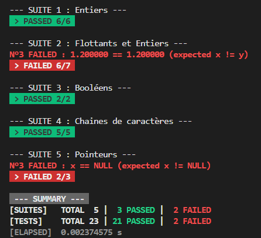

# Unit-Testing

Petit 'framework' de tests unitaires pour programme C/C++.

## `ASSERT`

Les fonctions `ASSERT_XXX` stoppent le programme si l'assertion est fause.

## `EXPECT`

Les fonctions `EXPECT_XXX` sont des fonctions non bloquantes qui ne sont utilisables que dans les fonctions de tests.

Pour ajouter une fonction de tests, aussi appelé une suite de tests, utilisez la fonction `add_suite`.
Ensuite il suffit de lancer tout les tests via la fonction `run_tests`.

## Affichage

La fonction `run_tests` affiche pour chaque suite de tests son nom ainsi que son résultat, contenant le nombre de tests réussis et, pour ceux qui ont échoués, les valeurs correspondantes.

Il y a ensuite un résumé statique à la fin ainsi que le temps écoulé.

